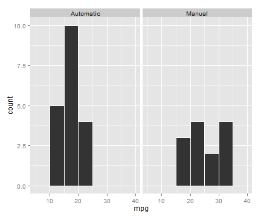

## Purpose of the shiny app

To visualize and present the impact on fuel efficiency in terms of miles/gallon by different factors:

1. Type of transmissions 
2. Number of cylinders
3. Number of forward gears

The shiny app built for this project is designed to show the aveage mpg and histogram of mpg by distinct automobile charateristics. The shiny app can be accessed at http://yanghs.shinyapps.io/my_app.

---
## Data

The data was extracted from the 1974 Motor Trend US magazine, and comprises fuel consumption and 10 aspects of automobile design and performance for 32 automobiles (1973-74 models). The data can be accessed by loading mtcars dataset in R. The variable description is as follows. 


```r
str(mtcars)
```

```
## 'data.frame':	32 obs. of  11 variables:
##  $ mpg : num  21 21 22.8 21.4 18.7 18.1 14.3 24.4 22.8 19.2 ...
##  $ cyl : Factor w/ 3 levels "4","6","8": 2 2 1 2 3 2 3 1 1 2 ...
##  $ disp: num  160 160 108 258 360 ...
##  $ hp  : num  110 110 93 110 175 105 245 62 95 123 ...
##  $ drat: num  3.9 3.9 3.85 3.08 3.15 2.76 3.21 3.69 3.92 3.92 ...
##  $ wt  : num  2.62 2.88 2.32 3.21 3.44 ...
##  $ qsec: num  16.5 17 18.6 19.4 17 ...
##  $ vs  : num  0 0 1 1 0 1 0 1 1 1 ...
##  $ am  : Factor w/ 2 levels "Automatic","Manual": 2 2 2 1 1 1 1 1 1 1 ...
##  $ gear: Factor w/ 3 levels "3","4","5": 2 2 2 1 1 1 1 2 2 2 ...
##  $ carb: num  4 4 1 1 2 1 4 2 2 4 ...
```

```r
round(sapply(mtcars, FUN = function(x) { c(mean = mean(x), sd = sd(x)) }), digits=2)
```

```
## Warning in mean.default(x): argument is not numeric or logical: returning
## NA
```

```
## Warning in mean.default(x): argument is not numeric or logical: returning
## NA
```

```
## Warning in mean.default(x): argument is not numeric or logical: returning
## NA
```

```
##        mpg  cyl   disp     hp drat   wt  qsec   vs  am gear carb
## mean 20.09   NA 230.72 146.69 3.60 3.22 17.85 0.44  NA   NA 2.81
## sd    6.03 0.89 123.94  68.56 0.53 0.98  1.79 0.50 0.5 0.74 1.62
```

---
## Histogram
Use the default setting, we can see the following histograms. It graphs the mpg by the type of transmissions when the binwidth is set to be 5. The binwidth can be adjusted with the slider and the automobile charaterics can be changed by selecting from the list of Variables.


```r
library(ggplot2)
ggplot(mtcars, aes(x=mpg)) + geom_histogram(binwidth=5,colour="white") + facet_grid(.~am)
```

 


---
## Results

- The figure suggests that cars with manual transmissions perform better in terms of fuel efficiency.
- The result shows that the number of cylinders negatively correlates to fuel efficiency.
- Based on the histogram, the number of gears does not show a strong positive relation with fuel efficiency, and it might be due to lack of data points with high number of gears.
